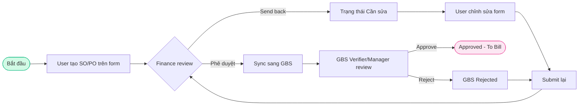
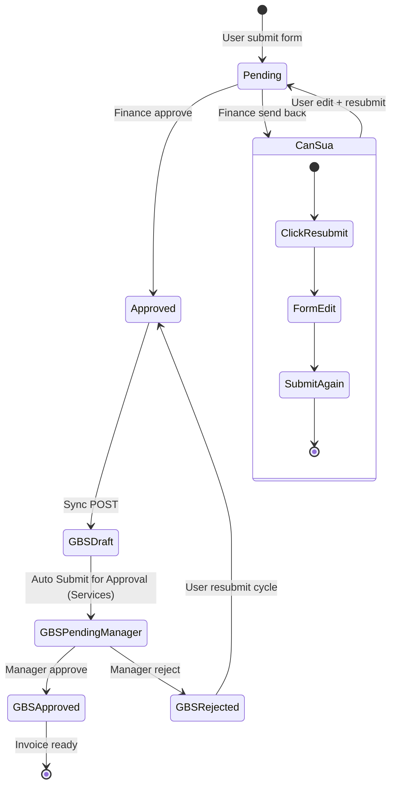
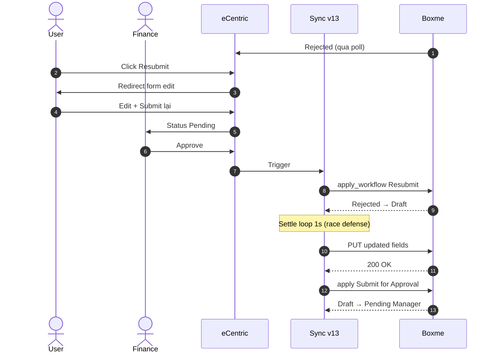

# /docs/gbs-flow — nguồn 3 sơ đồ

Trang hiển thị 3 sơ đồ dưới dạng **SVG vẽ sẵn** trong `main_section.html` (brief `NHIEU_LOP/brief_gbs.md` mục 5:
nội dung tài liệu nằm sẵn trong HTML, không vẽ lại bằng JS lúc tải). Trước 29/09/2026 trang nạp mermaid 10.9 từ CDN
rồi vẽ đè lên khối `<pre class="mermaid">`, nên người xem thấy mã nguồn sơ đồ rồi mới thấy hình.

## Sửa một sơ đồ

1. Sửa khối mermaid tương ứng bên dưới.
2. Vẽ lại bằng mermaid **10.9**, cấu hình như trang cũ: `theme: 'neutral'`,
   `flowchart: { useMaxWidth: true, htmlLabels: true, curve: 'basis' }`,
   `sequence: { useMaxWidth: true, showSequenceNumbers: false }`. Vẽ trên trình duyệt Windows/Mac
   (chữ đo bằng font Trebuchet MS — vẽ trên máy thiếu font này thì khung chữ lệch).
3. Lấy `outerHTML` của `<svg>`, bỏ thuộc tính `data-*` và các `<symbol>` không có `<use>` trỏ tới, rồi thay
   nội dung khối `<pre class="gfd-mmd">…</pre>` tương ứng trong `main_section.html`.
4. Làm đủ 3 bước resync (patch → `patches.txt` → `sha256` trong `resync_manifest.json`) và bump
   `BASELINE_SHA256` trong `page_sync.py`.

## Tổng quan — sơ đồ tổng thể (tab "Tổng quan")

## Happy path (tab "Happy path")

## Error & edge cases (tab "Error & Edge cases")

