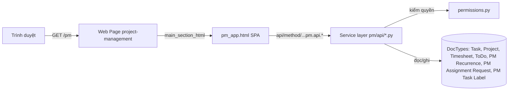
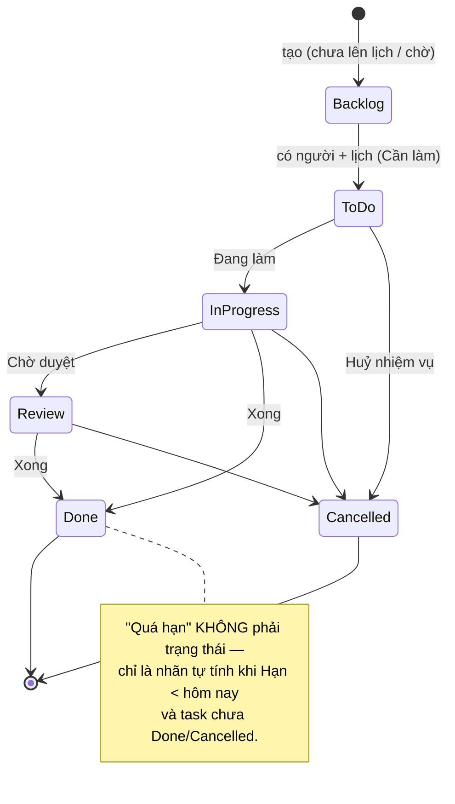
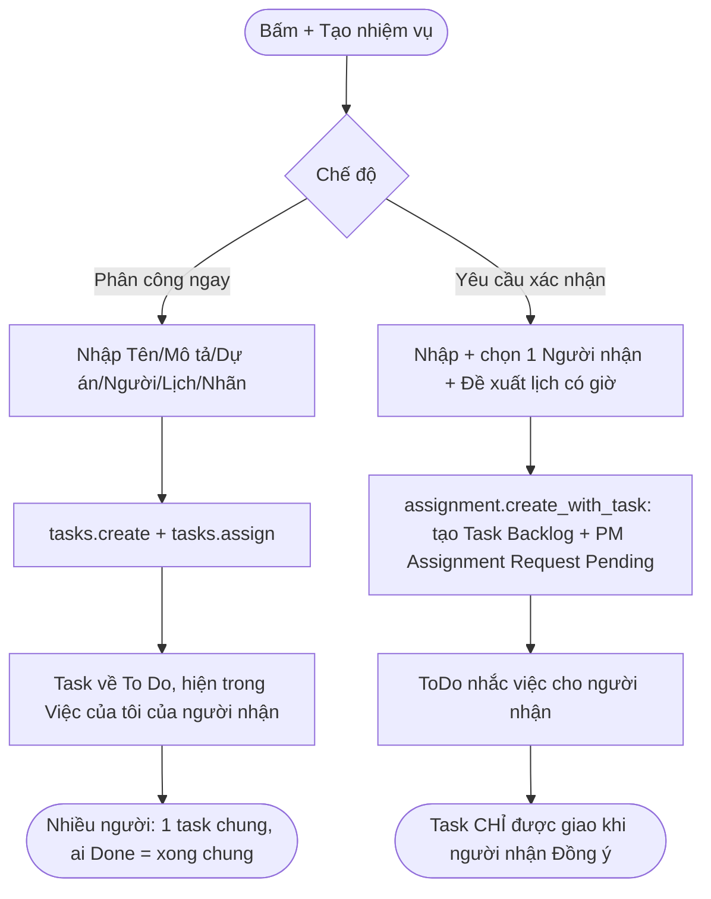
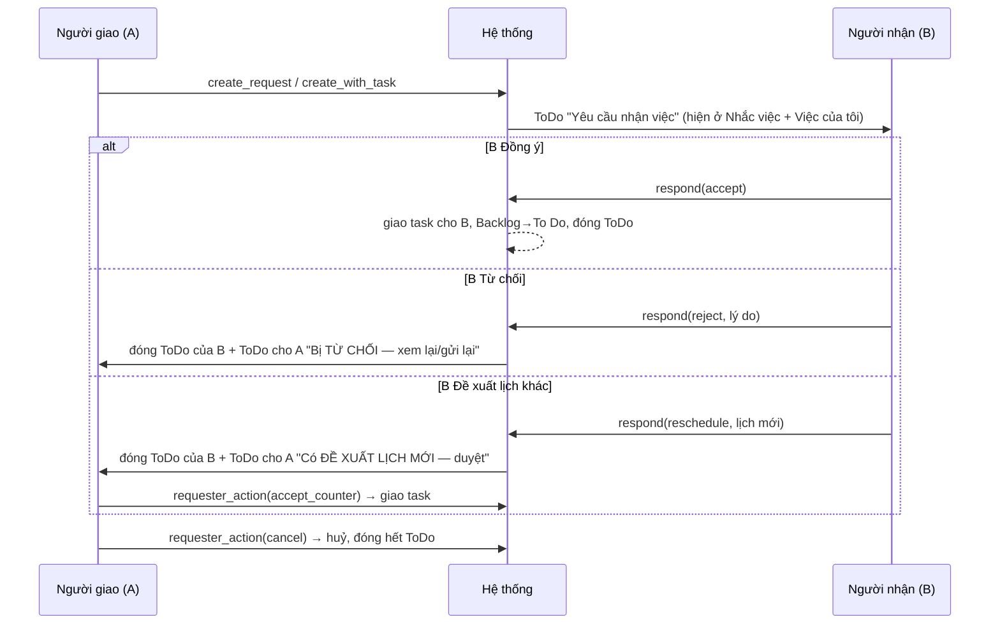
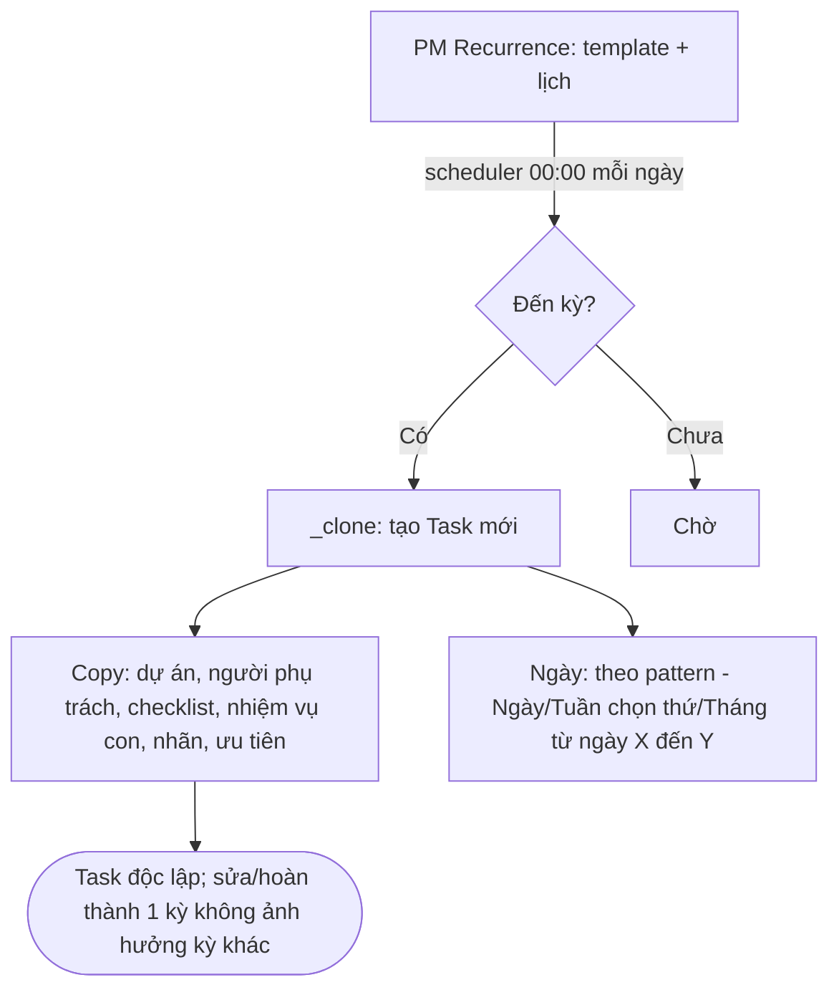
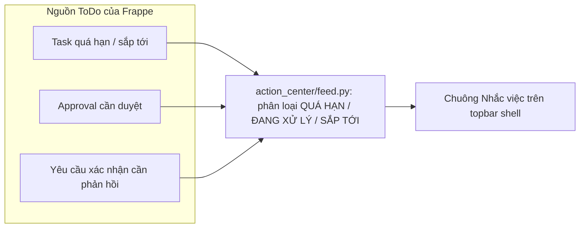

# Tài liệu Handover — Module Quản lý dự án (/pm)

> Tài liệu tổng hợp cho module PM trên ERP eCentric (`team.ecentric.vn/pm`). Dùng để onboarding người mới, handover, hoặc nạp cho AI. Cập nhật: 2026-08-09.

---

## 1. Tổng quan

`/pm` là một **SPA (single-page app)** quản lý dự án / nhiệm vụ, chạy trên nền **Frappe/ERPNext**. Toàn bộ giao diện nằm trong **một Web Page** tên `project-management` (route `/pm`); phần backend là các **whitelisted method** trong `ecentric_workspace/pm/api/*.py`, đọc/ghi trên **DocType native của ERPNext** (`Task`, `Project`, `Timesheet`, `ToDo`) cộng vài DocType tùy biến (`PM Recurrence`, `PM Assignment Request`, `PM Task Label`, `EC Field Description`).

Triết lý: **không tạo DocType mới nếu native đã đủ**; quyền được kiểm ở tầng service (`pm/permissions.py`), không bypass.

### Các phân hệ chính
| Màn hình | Route hash | Chức năng |
|---|---|---|
| Tổng quan | `#overview` | Dashboard số liệu, workload, phân bố |
| Việc của tôi | `#mywork` | Nhiệm vụ được giao cho tôi |
| Dự án | `#projects` | Danh sách/thẻ dự án, tạo/sửa, nhãn |
| Công việc | `#work/list` `#work/kanban` `#work/calendar` `#work/gantt` | 4 kiểu xem nhiệm vụ + tạo nhiệm vụ |
| Timesheet | `#timesheet` | Tổng hợp giờ + biểu đồ |
| Recurring | `#recurring` | Quy tắc lặp tự sinh nhiệm vụ |
| Yêu cầu giao việc | `#assignments/in` `#assignments/out` | Gửi/nhận yêu cầu xác nhận giao việc |

---

## 2. Kiến trúc & nơi chứa code

```
ecentric_workspace/
├─ pm/
│  ├─ frontend/
│  │  ├─ pm_app.html        ← TOÀN BỘ SPA (HTML+CSS+JS 1 file, ~390KB). Nguồn UI duy nhất.
│  │  └─ deploy_pm_app.ps1  ← script PUT pm_app.html vào Web Page project-management
│  ├─ pages.py              ← sync_pm_page(): đắp "shell chung" (chrome) lên trang sau khi PUT
│  ├─ permissions.py        ← require_pm_access, can_view_task/project, can_see_all_pm_data...
│  └─ api/
│     ├─ tasks.py           ← create, update, list, gantt_all, set_status, assign...
│     ├─ projects.py        ← list, create, update, get, add/remove_project_tag
│     ├─ timesheet.py       ← report (by_day/week/month), log, list
│     ├─ recurrence.py      ← list, create, create_from_task, update_template, engine _clone/_advance
│     ├─ assignment.py      ← create_request, create_with_task, respond, requester_action, ToDo nhắc việc
│     ├─ comments.py        ← add (sanitize), upload (file/ảnh), list
│     ├─ checklist.py       ← các bước trong nhiệm vụ
│     ├─ labels.py          ← PM Task Label (nhãn nhiệm vụ)
│     └─ meta.py            ← field_hints (ⓘ gợi ý field, từ DocType EC Field Description)
└─ public/charts/           ← ECCharts / ECChartTheme / PMCharts (echarts) dùng cho Timesheet
```

### Luồng render


---

## 3. Các FLOW chính

### 3.1 Vòng đời nhiệm vụ (Task workflow)

- UI hiện 4 nút trạng thái chính: **Cần làm / Đang làm / Chờ duyệt / Xong** + nút **Huỷ nhiệm vụ** riêng (đỏ). Trạng thái `Backlog`, `Blocked` bị ẩn khỏi UI (giữ trong workflow nhưng không thao tác).
- Giới hạn **2 tầng**: nhiệm vụ cha (depth 0) → nhiệm vụ con (depth 1). Con không có con.

### 3.2 Tạo & giao nhiệm vụ (2 chế độ)

- **Phân công ngay**: giao thẳng, hỗ trợ **nhiều người** (1 task chung).
- **Yêu cầu xác nhận**: 1 task ↔ 1 người nhận (ràng buộc "1 yêu cầu mở/1 task"); muốn nhiều người thì dùng Phân công ngay.

### 3.3 Yêu cầu xác nhận — vòng đời + nhắc việc (hand-off)

Trạng thái request: `Pending → Accepted / Rejected / Reschedule Proposed / Cancelled`. Bản ghi có **lịch sử audit** (không xoá cứng được).

### 3.4 Nhiệm vụ định kỳ (Recurrence)

- **Tần suất**: Hằng ngày / Hằng tuần (chọn nhiều thứ) / Hằng tháng (từ ngày X đến ngày Y → `monthly_day` + độ dài).
- **Weekly nhiều thứ** → mỗi thứ 1 task riêng. **Monthly X→Y** → mỗi tháng 1 task chạy ngày X→Y.
- Ngày task gốc không ảnh hưởng; pattern quyết định ngày mỗi bản sinh.
- Là **snapshot tại lúc sinh**: sửa rule → chỉ áp dụng cho các lần sinh sau.

### 3.5 Nhắc việc (Action feed shell)

"Nhắc việc" đọc **ToDo** của người dùng. Yêu cầu xác nhận nay tự tạo ToDo (mục 3.3) nên xuất hiện ở đây.

---

## 4. Hướng dẫn theo màn hình (step-by-step)

> Ảnh minh hoạ ở thư mục `./img/` (tên file ghi trong ngoặc). Nếu chưa có, xem mô tả bước.

### 4.1 Công việc — 4 kiểu xem  `(img/01-cong-viec-list.png, 02-kanban.png, 03-gantt.png, 04-lich.png)`
- Vào **Công việc**. Trên phải có 4 nút: **Danh sách · Kanban · Lịch · Gantt**.
- **Bộ lọc** (1 hàng): Tìm, Trạng thái, Người nhận, Nhãn, Dự án, Ưu tiên, + nhanh (Của tôi/Hôm nay/Tuần này/Quá hạn), nút Xoá.
- **Danh sách**: click tên nhiệm vụ để mở chi tiết; sửa nhanh từng ô (Hạn/Ưu tiên/Trạng thái/Người) ngay trên dòng; dòng "+ Thêm nhiệm vụ" để thêm nhanh.
- **Kanban**: nhóm theo **Trạng thái** hoặc **Người**; kéo-thả thẻ để đổi trạng thái / giao người.
- **Gantt**: header ngày **cố định** khi cuộn; cột tên khoá trái; **Mức** Ngày/Tuần/Tháng; mức Ngày hiện **thứ dưới ngày** + tô **cuối tuần**; kéo thanh để đổi lịch; "+" chỉ ở task cấp cao để thêm con.

### 4.2 Tạo nhiệm vụ  `(img/05-tao-nhiem-vu.png, 06-tao-nv-yeu-cau.png)`
1. Bấm **+ Tạo nhiệm vụ**.
2. Chọn tab **Phân công ngay** hoặc **Yêu cầu xác nhận**.
3. Nhập **Tên nhiệm vụ** (ô lớn trên cùng) + **Mô tả**.
4. **Dự án | Nhiệm vụ cha**, **Người phụ trách** (ô tìm-kiếm tên/email, chọn nhiều) **| Ưu tiên**, **Bắt đầu | Hạn**, **Nhãn** (tìm/tạo nhãn).
5. Yêu cầu xác nhận: chọn **1 Người nhận**, **Đề xuất bắt đầu/kết thúc (có giờ)**, **Lời nhắn**.
6. Bấm **Tạo nhiệm vụ** / **Gửi yêu cầu**.

### 4.3 Chi tiết nhiệm vụ  `(img/07-chi-tiet-nv.png)`
- **Bắt đầu/Hạn**: lịch xanh **có bánh xe giờ** (datetime), lưu khi chọn.
- **Phân rã công việc**: tab **Các bước** (checklist, sửa/xoá từng bước) + **Nhiệm vụ con**.
- **Workflow**: 4 nút trạng thái + **Huỷ nhiệm vụ** (đỏ, highlight khi đã huỷ).
- **Người thực hiện**: chip; nút **+** thêm người (nhập nhiều email cách nhau dấu phẩy).
- **Worktime**: Ghi giờ; tổng = giờ task cha + tổng giờ nhiệm vụ con.
- **Bình luận**: gõ, **dán link/ảnh trực tiếp (Ctrl+V)**, **kéo-thả file**, đính kèm 📎/🖼️, emoji.
- **Tạo định kỳ**: từ task cấp cao → mở modal lịch định kỳ.

### 4.4 Dự án  `(img/08-du-an.png, 09-tao-du-an.png)`
- Xem **Thẻ / Danh sách**; lọc theo trạng thái / phòng ban / **nhãn**.
- **+ Dự án mới**: Tên + Mô tả (ô lớn), **Quản lý** (tìm nhân viên), **Phòng ban**, Bắt đầu | Hạn, Ưu tiên, **Nhãn** (tìm/tạo).
- Thẻ dự án: thêm/bớt nhãn nhanh (tag brand), nhãn có màu, dùng chung cho mọi người thấy dự án.

### 4.5 Timesheet  `(img/10-timesheet.png)`
- Lọc: người / dự án / task / khoảng ngày.
- 5 thẻ: **Tổng giờ · TB giờ/ngày · Tuần này · Tháng này · Số log**.
- **Biểu đồ**: Giờ mỗi ngày · Số task mỗi ngày · Giờ theo dự án (donut) · Giờ theo người · Top task theo giờ · Xu hướng theo tuần · **Mật độ giờ** (toggle Ngày = heatmap / Tuần / Tháng = cột).
- Lưu ý: biểu đồ theo **ngày ghi nhận log** — ghi dồn cuối tuần sẽ lệch; xem mức Tuần/Tháng ổn định hơn.

### 4.6 Recurring (Định kỳ)  `(img/11-recurring.png, 12-tao-dinh-ky.png)`
- Thẻ: Quy tắc đang chạy / cần chú ý · Việc tạo hôm nay · Đang chờ xử lý · Việc bị quá hạn · Việc chưa có người làm.
- **+ Tạo việc định kỳ**: khối **Nội dung nhiệm vụ** (Tên/Mô tả/Ưu tiên/Dự án/Người) + Checklist + Nhiệm vụ con + khối **Lịch lặp** (Tần suất, thứ/từ-ngày-đến-ngày, Mỗi lần kéo dài, Bắt đầu áp dụng, Lặp cho tới ngày, **Dự kiến các lần sinh kế tiếp**).
- ⓘ cạnh nhãn = gợi ý (đồng bộ từ DocType `EC Field Description`, mọi user thấy).

### 4.7 Yêu cầu giao việc  `(img/13-yeu-cau-giao-viec.png)`
- Thẻ: Cần tôi phản hồi / Đang chờ phản hồi / Đề xuất lịch mới / Đã xử lý.
- Tab **Được giao cho tôi** (người nhận): **Đồng ý / Từ chối / Đề xuất lịch khác** (form 2 ô ngày-giờ + lý do).
- Tab **Tôi đã giao** (người gửi): xem trạng thái, **duyệt lịch mới / gửi lại / huỷ**.

---

## 5. Quyền hạn (Permissions)
- Mọi thao tác gate bằng `require_pm_access()` + `can_view_task/can_view_project`.
- **Quản lý / PM Manager / leader** (`can_see_all_pm_data`): thấy tất cả; người thường chỉ thấy việc của mình / được chia sẻ.
- Ghi trên Task/Project qua service layer với `ignore_permissions=True` **sau khi** đã kiểm quyền ở tầng trên (trust boundary).
- `PM Assignment Request` là **service-only** (guard chặn CRUD ngoài dịch vụ) + **audit append-only**.

---

## 6. API reference (whitelisted, prefix `ecentric_workspace.pm.api.`)
| Method | Ý nghĩa |
|---|---|
| `tasks.create` / `tasks.update` / `tasks.list` | tạo/sửa/liệt kê nhiệm vụ |
| `tasks.gantt_all` / `tasks.gantt` | dữ liệu Gantt (toàn bộ / theo dự án) |
| `tasks.set_status` / `tasks.assign` | đổi trạng thái / giao người |
| `projects.list/create/update/get` | dự án |
| `projects.add_project_tag` / `remove_project_tag` | nhãn dự án (DocTags) |
| `timesheet.report` / `log` / `list` | báo cáo giờ / ghi giờ |
| `recurrence.list/create/create_from_task/update_template/cancel/pause/resume/generate_now` | định kỳ |
| `assignment.create_request` / `create_with_task` | tạo yêu cầu (task cũ / task mới) |
| `assignment.respond` | người nhận Đồng ý/Từ chối/Đề xuất |
| `assignment.requester_action` | người gửi duyệt/gửi lại/huỷ |
| `assignment.list_incoming` / `list_outgoing` / `list_assignable` / `request_eligibility` | đọc |
| `comments.add/upload/list` · `checklist.*` · `labels.*` · `meta.field_hints` | phụ trợ |

---

## 7. Deploy & vận hành

**Frontend** (đổi `pm_app.html`): chạy 1 cụm (repo thật = `ERP Website\ecentric_workspace`):
```
cd "C:\Users\admin\NextCommerce\Data - Documents\General\ERP Website\ecentric_workspace"
git checkout feat/pm-recurrence-selfcontained -- ecentric_workspace/pm/frontend/pm_app.html
.\ecentric_workspace\pm\frontend\deploy_pm_app.ps1
$c = Import-Csv 'C:\Users\admin\NextCommerce\Data - Documents\General\ERP Website\frappe_api_keys -newww.csv' | Select-Object -First 1
Invoke-RestMethod -Method Post -Uri 'https://team.ecentric.vn/api/method/ecentric_workspace.pm.pages.sync_pm_page' -Headers @{ Authorization = "token $($c.api_key):$($c.api_secret)" }
```
Rồi mở `https://team.ecentric.vn/pm` + F5.

**Backend** (đổi `pm/api/*.py`): **Frappe Cloud → Apps → Update** (migrate + build).

**Lưu ý:**
- `deploy_pm_app.ps1` PUT thẳng → phải POST `sync_pm_page` sau để đắp lại shell chung (nếu không sẽ mất chrome). Gặp 503 = site đang restart, chờ rồi chạy lại.
- `/pm` là `no-store`, không có service worker → F5 thường là ra bản mới.
- Repo có 2 clone; **deploy repo thật = ERP Website\ecentric_workspace**.

---

## 8. Giới hạn đã biết / TODO
- **Gantt**: có 1 lỗi tô nền cột dính (compositing) khi cuộn ngang — đã tạm gác.
- **Timesheet heatmap**: chờ nhiều data thực để tinh chỉnh.
- **Datepicker** lịch xanh phụ thuộc bundle `ec_datepicker` (team khác) — nếu bundle không load, ô ngày về input mặc định.
- **Yêu cầu xác nhận** cố ý chỉ 1 người/nhiệm vụ (muốn nhiều → Phân công ngay).
- ToDo nhắc việc của yêu cầu tham chiếu Task → bấm mở chi tiết task (chưa nhảy thẳng trang Yêu cầu giao việc).
- Nhánh code: `feat/pm-recurrence-selfcontained` — cần push + PR merge vào `main`.

---

## 9. Sổ tay nhanh (cheat sheet)
- "Sinh" = hệ thống tự tạo task từ quy tắc lặp.
- "Quá hạn" = nhãn tự tính, không tự đổi trạng thái; task treo tới khi xử lý (Xong/Huỷ/dời hạn).
- Task định kỳ = bản sao độc lập; sửa/hoàn thành 1 kỳ không ảnh hưởng kỳ khác.
- Giao nhiều người "ai xong = xong chung" → **Phân công ngay** + chọn nhiều người (1 task chung).
