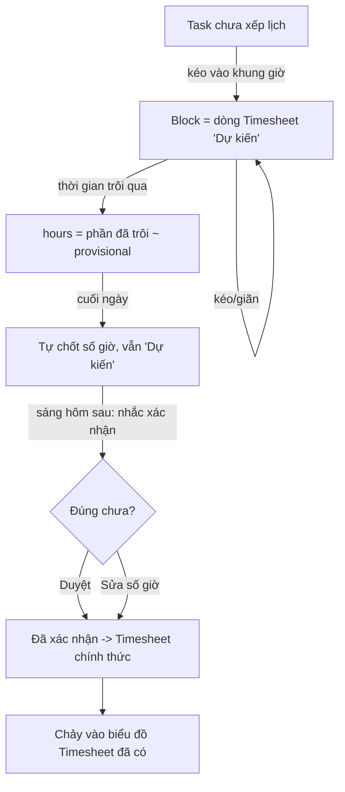

# Thiết kế: Lịch làm việc kéo–thả (Time-blocking) cho /pm

> Nguyên tắc số 1: **ĐƠN GIẢN**. Nếu thao tác rườm rà, nhân sự sẽ không dùng. Mọi quyết định dưới đây ưu tiên "ít bấm nhất", tái dùng dữ liệu đã có, không thêm DocType mới nếu tránh được.

Ngày tạo: 2026-08-12 · Trạng thái: DESIGN (chưa build)

---

## 1. Mục tiêu (một câu)

Cho mỗi người **kéo task vào khung giờ trong tuần để lên kế hoạch làm**; khi thời gian trôi qua block, hệ thống **tự ghi giờ thực tế vào Timesheet** — như bấm giờ nhưng khỏi phải bấm.

## 2. Ý tưởng cốt lõi (điểm làm nó đơn giản)

**Một "block" = một dòng trong doctype nhỏ `EC PM Time Block`** (fields: `task`, `user`, `start`, `end`, `state` Dự kiến/Đã xác nhận). LÝ DO không dùng thẳng Timesheet: Frappe Timesheet **chặn 2 dòng giờ trùng nhau**, mà ta cần "nhiều task cùng khung giờ" → phải có chỗ lưu cho phép overlap. Doctype này rất nhẹ (5 field, không submit workflow). Khi **xác nhận**, block sinh ra một dòng Timesheet chính thức để chảy vào báo cáo giờ hiện có.

- Lịch tuần chỉ là **giao diện trực quan** để xem/kéo/thả các dòng Timesheet của chính mình.
- Kéo task vào ô trống → tạo một dòng Timesheet (`from_time`/`to_time` = block, trạng thái `Dự kiến`).
- Kéo/giãn block → sửa `from_time`/`to_time` của dòng đó.
- Thời gian trôi qua block → `hours` = phần đã trôi (tính động ở UI, chốt số ở bước xác nhận).

Chỉ cần **1 custom field** trên Timesheet Detail: `ec_block_state` = `Dự kiến` / `Đã xác nhận` (mặc định Dự kiến). Không có gì khác.

## 3. Mô hình giờ: dự kiến → thực tế (đã chốt phương án C)

- **Block = giờ dự kiến.** Ví dụ 12/08: A đặt 9–12h, B đặt 14–16h.
- **Giờ trôi qua tự thành thực tế (provisional).** Lúc 15h: A (đã qua) = 3h; B (đang chạy) = 1h. Hiển thị động ở UI, chưa cần bấm.
- **Cuối ngày tự chốt** các block đã qua thành thực tế (`ec_block_state` giữ `Dự kiến` nhưng `hours` đã có số).
- **Sáng hôm sau nhắc "Xác nhận giờ hôm qua"** — 1 danh sách, mỗi dòng sửa nhanh số giờ rồi bấm duyệt → `ec_block_state = Đã xác nhận`. Vừa khỏi bấm liên tục, vừa không ghi khống.
- **Xác nhận = chính nhân sự tự duyệt giờ của mình. KHÔNG có bước quản lý phê duyệt.** Quản lý chỉ xem (read-only). Nhân sự bấm xác nhận là số giờ chính thức.

### 3b. Kéo vào quá khứ = ghi giờ hồi tố

Cùng một thao tác kéo, hệ thống hiểu theo mốc thời gian:
- **Kéo vào tương lai / hôm nay chưa tới giờ** → block **Dự kiến** (nét đứt).
- **Kéo vào quá khứ (hôm qua, hoặc giờ đã trôi hôm nay)** → **ghi bù giờ đã làm**: block hiện ngay dạng "đã trôi qua" (xanh), KHÔNG phải dự kiến.
- Vì hồi tố nên **luôn cần bước xác nhận** (không tự chốt âm thầm) → chống ghi khống; quản lý xem được.
- **Giới hạn lùi trong tuần hiện tại**. Xa hơn → nhập thẳng Timesheet như cũ, tránh sửa số liệu cũ.

## 4. Panel khi bấm "Xong" (ý người dùng)

Khi hoàn thành 1 task, hiện panel:
- Giờ thực tế **tự điền từ block**, cho sửa.
- **Lịch sử** các lần đã ghi Timesheet cho task đó (ngày · số giờ).
- **Tổng giờ** đã ghi cho task.
- Nút **Ghi thêm giờ** nếu thấy thiếu.

(Đây chính là một filter view trên các dòng Timesheet của task — không cần lưu gì mới.)

## 5. Phân quyền

| Vai trò | Xem lịch mình | Kéo/sửa lịch mình | Xem lịch người khác | Kéo/sửa lịch người khác |
|---|---|---|---|---|
| Nhân sự | ✅ | ✅ | ❌ | ❌ |
| Quản lý (Management - EC) | ✅ | ✅ | ✅ (read-only) | ❌ |

- "Quản lý" = phòng `Management - EC` (theo quy tắc phân quyền hiện có — KHÔNG dùng `reports_to`/designation).
- Đọc/ghi Timesheet đã có sẵn quyền trong Frappe; chỉ cần cổng đọc read-only cho quản lý xem lịch người khác.

## 6. Luồng chính

## 7. API cần thêm (nhỏ, tái dùng Timesheet)

- `pm.api.schedule.week(user=None, week=...)` — trả các block (Timesheet Detail) của user trong tuần để render lịch. Quản lý truyền `user` khác = read-only.
- `pm.api.schedule.place(task, from_time, to_time)` — tạo/ghi block (dòng Timesheet Dự kiến).
- `pm.api.schedule.move(row, from_time, to_time)` — kéo/giãn.
- `pm.api.schedule.remove(row)` — bỏ block khỏi lịch.
- `pm.api.schedule.pending_confirm(user)` + `confirm(rows)` — danh sách chờ xác nhận + duyệt.

Tất cả đọc/ghi vào Timesheet hiện có; không thêm bảng mới.

## 8. Lộ trình (làm dần, mỗi phần deploy được)

- **P1 — Kéo–thả lịch tuần (giá trị lớn nhất, đơn giản nhất).** Nâng Calendar view thành lịch tuần theo giờ; panel "chưa xếp lịch" bên trái; kéo task vào → tạo block; kéo/giãn đổi giờ. Lưu vào Timesheet (Dự kiến). Chưa auto-actual.
- **P2 — Auto thực tế + xác nhận.** Giờ trôi qua hiện provisional; cuối ngày tự chốt; sáng hôm sau nhắc xác nhận. Panel "Xong" (lịch sử + tổng + ghi thêm).
- **P3 — Quản lý xem read-only** lịch nhân viên.
- **P4 (tương lai) — Đồng bộ lịch MS Teams/Outlook.** Kéo họp từ Teams vào lịch làm việc (chặn khung bận), hoặc đẩy block sang Outlook. Dùng Graph app-only token server-side (đã có sẵn cơ chế SSO Microsoft).

## 9. Giữ cho đơn giản — điều KHÔNG làm (tránh phình)

- KHÔNG tạo DocType "Time Block" riêng — dùng Timesheet.
- KHÔNG bắt bấm giờ start/stop thủ công — block + auto là đủ.
- KHÔNG cho quản lý kéo lịch người khác (chỉ xem) — tránh tranh chấp.
- KHÔNG auto-ghi khống — cuối ngày mới chốt, có bước xác nhận nhẹ.
- KHÔNG làm drag mượt phức tạp ở P1 nếu tốn thời gian — kéo theo ô 30' là đủ.

## 10. Thông số P1 (ĐÃ CHỐT 2026-08-12)

- **Bước giờ = 15 phút** (kéo/giãn snap theo 15').
- **Khung giờ = cả ngày (00–24h)** và **cả tuần 7 ngày** (T2→CN, gồm cuối tuần).
- **Một khung giờ chứa nhiều task** — khi trùng giờ, các block xếp **cạnh nhau chia cột** trong cùng ô (giống Google Calendar). Xem §11.
- Một task có thể có **nhiều block** trong ngày/tuần (đúng như panel lịch sử) — OK.

## 11. Block trùng giờ (overlap) — xếp cạnh nhau

Giống hình Google Hoàn gửi: nếu nhiều block đè lên cùng khoảng giờ trong một ngày, chia đều **bề ngang cột ngày** cho số block trùng (2 block = mỗi cái 50%, 3 block = 33%…), xếp cạnh nhau. Thuật toán gọn: gom các block cùng ngày thành "cụm giao nhau", trong mỗi cụm tính số cột song song tối đa rồi trải đều. Không cần thư viện — vài chục dòng JS layout. Giữ ở mức đủ đọc, không cầu kỳ.
